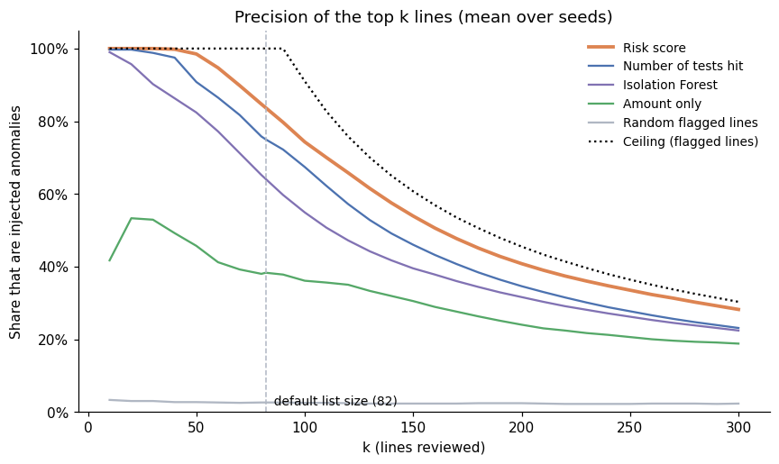
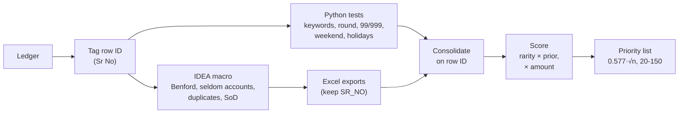

# gl-risk-scoring

[](https://github.com/luke-menezes/gl-risk-scoring/actions/workflows/tests.yml)

[](LICENSE)

**Ranking flagged journal entries for audit review, on synthetic general ledgers.**

On synthetic ledgers, the top-82 list is 83.7% precise (± 2.7 points over 30 seeds), against
75.0% for counting how many tests each line hits and 64.1% for an Isolation Forest.

Journal entry testing in an audit runs a set of simple tests over the general ledger: weekend
postings, round amounts, suspicious keywords, Benford's Law, seldom-used accounts, duplicates,
segregation of duties. On a typical ledger these flag thousands of lines, often a fifth of the
ledger, far more than anyone can review. This project combines every test's flags on a row ID and
ranks the lines with a transparent score, so the review starts with the entries most likely to
matter, and each line on the list shows why it is there.



## Pipeline



## Key design decisions

- **One row ID, tagged before the split.** The ledger gets a running number (`Sr No`) before the
  same file goes to Caseware IDEA and to Python. Every IDEA export keeps it, so the results join
  exactly. A hash of the row wouldn't work: identical duplicate lines would share it. Matching on
  date, account and amount fails for the same reason. See [`idea/README.md`](idea/README.md).
- **Weight = ledger rarity × prior.** Rarity is `-log10(share of the ledger flagged)`, so a test
  that flags 0.2% of lines counts much more than one that flags 12%. The prior carries what the
  test has been worth across past ledgers; the values here are illustrative.
- **Correlated tests count once.** A Saturday that is also a public holiday is one calendar signal,
  not two, so only the strongest date test counts for each line.
- **Benford scaled by amount diversity.** In ledgers full of repeated amounts, Benford failures are
  expected and carry little information, so its weight shrinks with the share of distinct amounts.
- **Amount as a log multiplier.** `1 + log10(1 + amount / median)`: large lines rise without a hard
  cut-off, and one rare flag on a very large entry can still make the list.
- **List size grows with √n.** `clip(0.577·√n, 20, 150)`: about 100 lines for a 30,000-line
  ledger, never more than a reviewer can work through.

**What the benchmark can and can't show.** On the synthetic ledgers, per-ledger rarity and the
amount multiplier clearly earn their place. The priors, the date collapse and the Benford scaling
make no measurable difference here, and rarity alone scores slightly higher than the full score
(within one standard deviation). The synthetic data can't test these three: it has no history for
priors to encode, few lines where calendar tests stack, and almost no repeated amounts. They stay
because the production tooling has to handle exactly those cases on real ledgers.

More detail in [`DESIGN.md`](DESIGN.md).

## Results on synthetic data

Each ledger has 20,000 lines with 0.5% injected anomalies, all with a larger amount. Nine in ten
carry one to four red flags; the other tenth are "silent", an unusual amount on a common account
on a weekday, with nothing for any test to find. Alongside them is normal business
that trips the tests anyway: round rent payments, director fees, a fixed-price supplier, weekend
postings and double postings. The priority list is 82 lines. Figures are the mean ± standard deviation over 30 seeds (30 different
ledgers), from `scripts/run_benchmark.py`; every run is in
[`docs/benchmark.csv`](docs/benchmark.csv), and the full tables are in
[`docs/benchmark_results.md`](docs/benchmark_results.md).

| Ranking | Precision@82 | Recall@82 |
|---|---|---|
| **Risk score** | **0.837 ± 0.027** | **0.686 ± 0.022** |
| Number of tests hit | 0.750 ± 0.028 | 0.615 ± 0.023 |
| Isolation Forest (unsupervised, line features) | 0.641 ± 0.058 | 0.526 ± 0.047 |
| Amount only | 0.383 ± 0.044 | 0.314 ± 0.036 |
| Random flagged lines | 0.026 ± 0.017 | 0.021 ± 0.014 |
| Ceiling: best any ranking of flagged lines can do | 1.000 | 0.910 ± 0.008 |

How to read the ceiling: recall can't exceed the share of anomalies that trip at least one test,
and precision can't exceed that count divided by k. The silent anomalies trip no test (apart from
the odd chance hit, such as Benford's first digit or a public holiday), so no ranking of flagged
lines can reach them and recall tops out at about 0.91. With 100 anomalies and a list of 82,
recall is also capped at 0.82 by the list size. The Isolation Forest ranks the whole ledger, so it could in principle find
silent anomalies through their amount, but it still ranks below the rules-based scores.

### Which design choices earn their place

The same 30 ledgers, scored with one idea switched off at a time:

| Variant | Precision@82 | What it shows |
|---|---|---|
| Full risk score | 0.837 ± 0.027 | |
| Rarity only (all priors = 1) | 0.850 ± 0.028 | The illustrative priors add nothing here: the synthetic data has no history for them to encode. Their job on real ledgers is to carry what past engagements showed |
| Priors only (no rarity) | 0.767 ± 0.039 | Rarity is the main driver: per-ledger rarity is worth about 7 points |
| Date tests not collapsed | 0.837 ± 0.026 | No effect: few injected anomalies fall on a weekend *and* a holiday. It matters where calendar tests pile up (weekend holidays, period ends) |
| No amount multiplier | 0.779 ± 0.039 | Lifting large entries is worth about 6 points |
| No Benford diversity scaling | 0.837 ± 0.027 | No effect: almost every synthetic amount is distinct, so the factor is already 1. It matters in ledgers of repeated fixed amounts |

### Sweeps

Share of ceiling is precision@k divided by the best possible precision@k, so rows with different
ceilings can be compared. The size sweep keeps about 1.2 anomalies per list place (as in the
20,000-line ledger), so it tests the ranking, not the ratio of anomalies to list places.

| Ledger | k | Risk score: precision@k (share of ceiling) | Tests hit: precision@k (share of ceiling) |
|---|---|---|---|
| 2,000 lines, 31 anomalies | 26 | 0.888 ± 0.063 (0.888) | 0.845 ± 0.083 (0.845) |
| 20,000 lines, 100 anomalies | 82 | 0.837 ± 0.027 (0.837) | 0.750 ± 0.028 (0.750) |
| 200,000 lines, 180 anomalies (10 seeds) | 150 | 0.737 ± 0.044 (0.737) | 0.557 ± 0.036 (0.557) |
| 20,000 lines, 0.1% (20 anomalies) | 82 | 0.202 ± 0.013 (0.908) | 0.172 ± 0.020 (0.769) |
| 20,000 lines, 0.2% (40 anomalies) | 82 | 0.395 ± 0.018 (0.884) | 0.339 ± 0.026 (0.759) |
| 20,000 lines, 1.0% (200 anomalies, saturated) | 82 | 0.999 ± 0.003 (0.999) | 0.989 ± 0.022 (0.989) |

The bigger the ledger, the harder the ranking gets, and the further the risk score pulls ahead of
counting tests: 4 points of share of ceiling at 2,000 lines, 18 at 200,000. When anomalies are
scarce it stays at about 0.9 of the ceiling; the 1% row is saturated (more anomalies than list
places), so it can't separate the methods.

**Caveat.** The anomalies come from the same generator the scoring was designed around, so this
shows the method does what it was designed to do, and which parts matter. It isn't evidence about
real ledgers, where the irregular entries are unknown.

### Why each line is on the list

`score_flags` adds a `Score Breakdown` column. The top 5 of the seed-0 list (synthetic
descriptions):

| Sr No | Description | Amount | Score | Score Breakdown |
|---|---|---|---|---|
| 3348 | Write off - settlement | 87,999 | 39.8 | Seldom Account Entries 6.8 + Ending 99/999 3.9 + Suspicious Keyword 3.5 + SoD Violation Entries 2.7, × amount 2.35 |
| 7390 | Write off - settlement | 133,999 | 35.9 | Seldom Account Entries 6.8 + Ending 99/999 3.9 + Suspicious Keyword 3.5, × amount 2.53 |
| 2488 | Cash advance, no invoice | 102,999 | 34.4 | Seldom Account Entries 6.8 + Ending 99/999 3.9 + Suspicious Keyword 3.5, × amount 2.42 |
| 18687 | Cash advance, no invoice | 46,999 | 32.9 | Seldom Account Entries 6.8 + Ending 99/999 3.9 + Suspicious Keyword 3.5 + date (Sunday) 1.0 + Benford 0.5, × amount 2.10 |
| 8627 | Customer receipt | 170,000 | 32.6 | Seldom Account Entries 6.8 + Rounded Amount 2.9 + SoD Violation Entries 2.7, × amount 2.63 |
| 4026 | Utility bill | 150,000 | 34.5 | Seldom Account Entries 6.8 + Rounded Amount 2.9 + SoD Violation Entries 2.6 + date (Saturday) 1.0, × amount 2.58 |
| 3648 | Adjustment per director | 54,999 | 33.0 | Seldom Account Entries 6.8 + Ending 99/999 3.9 + Suspicious Keyword 3.5 + date (Saturday) 1.0, × amount 2.16 |

## Why not a trained model?

- **Real audits have no labels.** Nobody hands the auditor a column saying which entries were
  fraudulent, so there is nothing to train a supervised model on. The Isolation Forest above needs
  no labels, but it ranks the lines below the risk score.
- **Auditors have to explain the selection.** A reviewer must be able to say why a line was
  picked, and the score breakdown does that directly. An anomaly score from a model doesn't.
- **Future work: learn the priors.** Reviewer outcomes (which listed lines turned out to be issues)
  are labels. With enough of them, the priors could be learned, for example with a logistic
  regression on the test columns. That isn't done here.

## Run it

```bash
python -m venv .venv && source .venv/bin/activate     # Windows: .venv\Scripts\activate
pip install -e ".[dev,ml]"                             # [ml] adds scikit-learn for the Isolation Forest
pytest
jupyter notebook notebooks/demo.ipynb
python scripts/run_benchmark.py                        # about 30 minutes; --quick for a smoke test
```

```python
from glrisk import flags, pipeline, scoring, synthetic

ledger = synthetic.make_ledger(20_000, seed=0)
amount_cols = synthetic.amount_columns(ledger)
flagged = flags.consolidate(ledger,
                            pipeline.run_python_tests(ledger, amount_cols),
                            flags.load_idea_flags("fixtures/idea_exports"))
priority = scoring.score_flags(flagged, amount_cols)          # top 0.577·√n lines, with Score Breakdown
```

`fixtures/idea_exports` holds mock IDEA exports made from the same seeded ledger
(`scripts/make_fixtures.py`), so everything runs without an IDEA licence. With IDEA, run
[`idea/portfolio_sample.ism`](idea/portfolio_sample.ism) and point `load_idea_flags` at the
project's `Exports.ILB` folder.

## Layout

| Path | Contents |
|---|---|
| `src/glrisk/synthetic.py` | Ledger generator with injected anomalies (ground truth) |
| `src/glrisk/rules.py` | The tests: keywords, round, 99/999, day of week, public holidays, duplicates, seldom accounts, segregation of duties |
| `src/glrisk/benford.py` | First-digit test, MAD conformity, entries behind over-represented digits |
| `src/glrisk/flags.py` | Flag logs, IDEA export loader, consolidation on the row ID |
| `src/glrisk/scoring.py` | Weights, date tests counted once, amount multiplier, list size, score breakdown |
| `src/glrisk/evaluate.py` | Rankings, ceilings, precision and recall at k, multi-seed runs and ablation |
| `src/glrisk/ml_baseline.py` | Isolation Forest baseline (optional `[ml]` extra) |
| `src/glrisk/pipeline.py` | Runs the Python tests; computes and writes the mock IDEA exports |
| `src/glrisk/plots.py` | The demo and benchmark charts |
| `scripts/` | Fixture builder and the benchmark |
| `idea/` | IDEAScript sample and the cross-tool design |

## What I'd do next

- **Learn the priors from reviewer outcomes**, once enough reviewed lists exist (see above).
- **Client-specific baselines**: compare each test's rate with the same client's prior years, not
  only with the current ledger.
- **A content hash key** for matching extracts pulled independently from a client's system, where a
  shared running number isn't possible.

## About this project

I built tooling like this in my work as a data analyst. This repository is a reduced, sanitised
version on synthetic data. The production tooling and all client data stay private, and the
scoring priors here are illustrative.

MIT licence.
