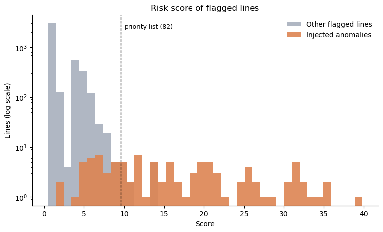
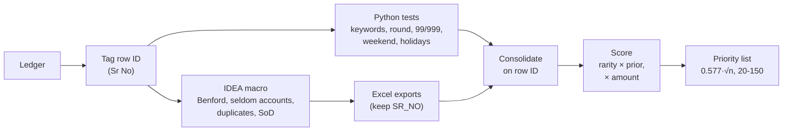

# gl-risk-scoring

**Ranking flagged journal entries for audit review, on a synthetic general ledger.**

Journal entry testing in an audit runs a set of simple tests over the general ledger: weekend
postings, round amounts, suspicious keywords, Benford's Law, seldom-used accounts, duplicates,
segregation of duties. On a typical ledger these flag thousands of lines, often a fifth of the
ledger, far more than anyone can review. This project combines every test's flags on a row ID and
ranks the lines with a transparent score, so the review starts with the entries most likely to
matter. It then checks the ranking against anomalies injected into the ledger on purpose.



## Pipeline



## Key design decisions

- **One row ID, tagged before the split.** The ledger gets a running number (`Sr No`) before the
  same file goes to Caseware IDEA and to Python. Every IDEA export keeps it, so the results join
  exactly. A hash of the row wouldn't work: identical duplicate lines would share it. Matching on
  date, account and amount fails for the same reason. See [`idea/README.md`](idea/README.md).
- **Weight = ledger rarity × prior.** Rarity is `-log10(share of the ledger flagged)`, so a test
  that flags 0.2% of lines counts much more than one that flags 12%. The prior carries what the
  test has been worth across past ledgers; the values here are illustrative.
- **Correlated tests count once.** A Saturday that is also a public holiday is one calendar signal,
  not two, so only the strongest date test counts for each line.
- **Benford scaled by amount diversity.** In ledgers full of repeated amounts, Benford failures are
  expected and carry little information, so its weight shrinks with the share of distinct amounts.
- **Amount as a log multiplier.** `1 + log10(1 + amount / median)`: large lines rise without a hard
  cut-off, and one rare flag on a very large entry can still make the list.
- **List size grows with √n.** `clip(0.577·√n, 20, 150)`: about 100 lines for a 30,000-line
  ledger, never more than a reviewer can work through.

More detail in [`DESIGN.md`](DESIGN.md).

## Results on synthetic data

A 20,000-line ledger (seed 0) with 100 injected anomalies, each carrying one to four red flags,
alongside normal business that trips the tests anyway (round rent payments, director fees, a
fixed-price supplier, weekend postings, double postings). 4,290 lines (21%) are flagged by at
least one test, and the priority list has 82 lines:

| Ranking | Precision@82 | Recall@82 |
|---|---|---|
| **Risk score** | **0.854** | **0.700** |
| Number of tests hit | 0.756 | 0.620 |
| Amount only | 0.329 | 0.270 |
| Random flagged lines | 0.027 | 0.022 |

Counting tests treats a weekend posting like a posting to an account used twice a year; weighting
by rarity tells them apart. The anomalies come from the same generator the scoring was designed
around, so this shows the method works as intended, not how it performs on real ledgers.

The full walk-through, with charts, is in [`notebooks/demo.ipynb`](notebooks/demo.ipynb).

## Run it

```bash
python -m venv .venv && source .venv/bin/activate     # Windows: .venv\Scripts\activate
pip install -e ".[dev]"
pytest
jupyter notebook notebooks/demo.ipynb
```

```python
from glrisk import flags, pipeline, scoring, synthetic

ledger = synthetic.make_ledger(20_000, seed=0)
amount_cols = synthetic.amount_columns(ledger)
flagged = flags.consolidate(ledger,
                            pipeline.run_python_tests(ledger, amount_cols),
                            flags.load_idea_flags("fixtures/idea_exports"))
priority = scoring.score_flags(flagged, amount_cols)          # top 0.577·√n lines
```

`fixtures/idea_exports` holds mock IDEA exports made from the same seeded ledger
(`scripts/make_fixtures.py`), so everything runs without an IDEA licence. With IDEA, run
[`idea/portfolio_sample.ism`](idea/portfolio_sample.ism) and point `load_idea_flags` at the
project's `Exports.ILB` folder.

## Layout

| Path | Contents |
|---|---|
| `src/glrisk/synthetic.py` | Ledger generator with injected anomalies (ground truth) |
| `src/glrisk/rules.py` | The tests: keywords, round, 99/999, day of week, public holidays, duplicates, seldom accounts, segregation of duties |
| `src/glrisk/benford.py` | First-digit test, MAD conformity, entries behind over-represented digits |
| `src/glrisk/flags.py` | Flag logs, IDEA export loader, consolidation on the row ID |
| `src/glrisk/scoring.py` | Weights, date tests counted once, amount multiplier, list size |
| `src/glrisk/evaluate.py` | Precision and recall at k against baselines |
| `src/glrisk/pipeline.py` | Runs the Python tests; writes the mock IDEA exports |
| `src/glrisk/plots.py` | The demo charts |
| `idea/` | IDEAScript sample and the cross-tool design |

## About this project

I built tooling like this in my work as a data analyst, for journal entry testing on audit
engagements. This repository is a reduced, sanitised version on synthetic data. The production
tooling and all client data stay private, and the scoring priors here are illustrative.

MIT licence.
